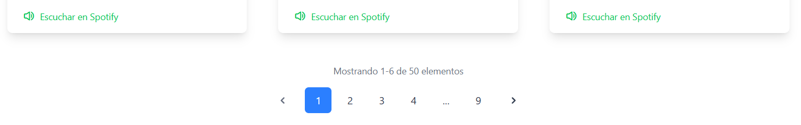
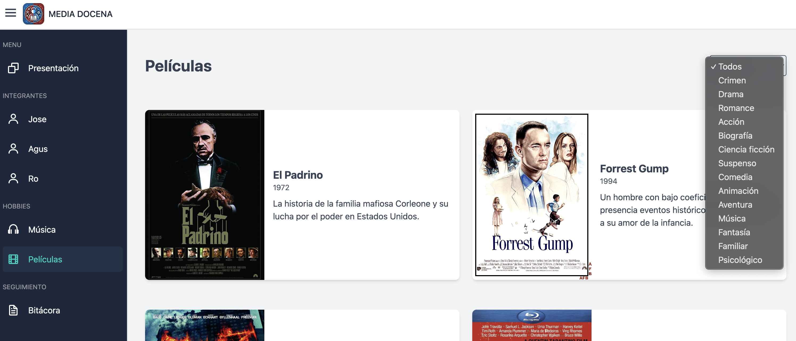
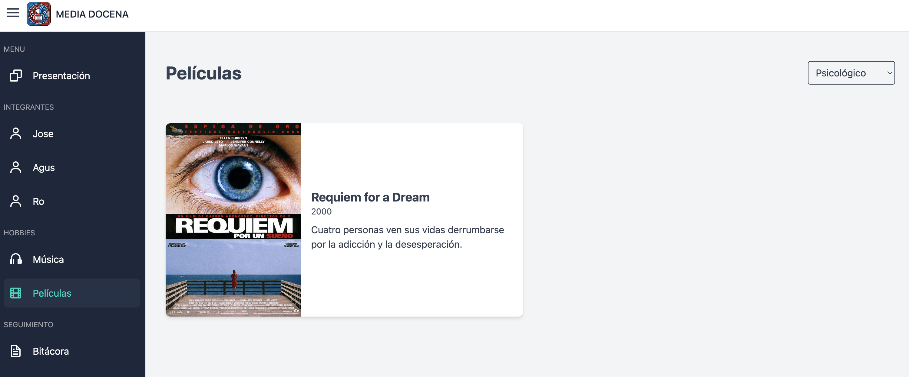

# Práctica Formativa Grupal

Este proyecto corresponde a la práctica formativa grupal de la materia de "Desarrollos de Sistemas Web Frontend" del segundo año de la carrera de Tecnicatura Superior en Desarrollo de Software a Distancia.

## Secciones

El proyecto contiene las siguiente secciones y componentes:

- Sidebar (barra lateral fija)
- Presentación del grupo de trabajo
- Portfolio individual por integrante
- Manejo de datos mediante archivo JSON
- Manejo de datos mediante API
- Bitácora del desarrollo del proyecto

## Mejoras implementadas

Se implementaron mejoras en la interfaz tales como:

- Transiciones entre paginas para una experiencia más fluida.
- Efecto hover en tarjetas para destacar información.
- Animación con efecto de escalado en íconos de tecnologías.
- Paginación en la sección de música.
  
- Filtrado por categoría en la sección de películas.
  
  
